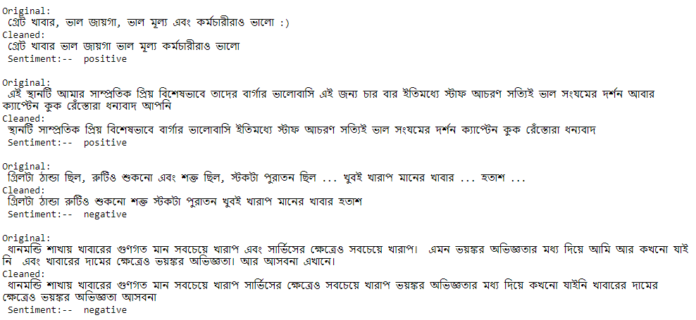
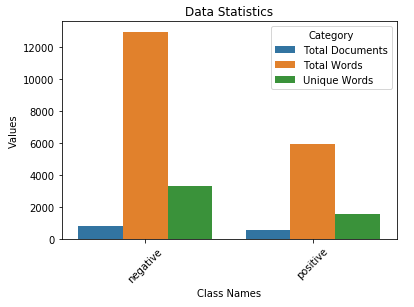
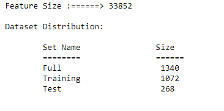
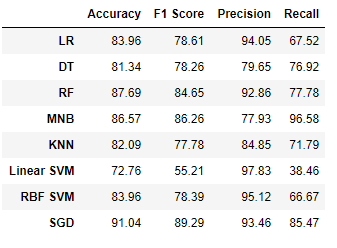

## Sentiment Analysis of Bengali Restaurant Reviews Using Machine Learning: Project overview
- Created a tool that can identify the sentiment of a restaurant review written in Bengali Text. It classifies a review as **positive or negative** sentiment.   
- Collected `1.4k` Bengali restaurant reviews from different social media groups of food or restaurant reviews. Among these reviews `630` reviews are labelled as positve and `790` reviews are labeled as negative sentiment.
- Use Bengali *stopword list* for removing some words that have not much impact on classification.
- Extract `Unigram, Bigram and Trigram` features from the cleaned Text and use the `TF-idf vectorizer` as a feature extraction technique.
- Employed different machine learning classifiers for the classification purpose. The used classifiers are `Logistic Regression, Decision Tree, Multinomial Naive Bayes, Support Vector Machine`, `Stochastic Gradient Descent` and so on.
- Evaluate the performance of the classification for every gram feature. `Accuracy, Precision, Recall, F1-score, ROC curve and Precision-Recall curve` used as evaluation metrics.
- Finally created a `client facing API` using Flask and deployed into cloud using `Heroku`. 

## Project Outline 
- Dataset Preparation
- Dataset Summary 
- Feature Extraction
- Model Evaluation
    - Numerical Measures
    - Graphical Measures
- Model Deployment

## Dataset Preparation
`1.4k` Bengali restaurant reviews are collected from different social media groups where food and restaurant reviews are provided by the customers. **The dataset is available at this repository**. Then, the data's are cleaned by removing unneccessary symbols, tokens and numbers from the texts. 

**Dataset Description:** 

All the collected reviews are manually annotated by two native Bengali speaker. The dataset consists of two columns. First column is `Reviews` column which is filled with the bengali restaurant reviews and second column is the `Sentiment` column which contains corresponding labels of the reviews (`positive  or negative`).

| Index         | Reviews        | Sentiment  |
| ------------- |:-------------:| -----:|
| 1      | Review 1      |    `positive` |
| 2      | Review 2      |    `positive` |
| 1400   | Review 1400   |    `negative` |

**Some sample reviews from the dataset:**

## Summary of the dataset

Dataset summary includes various information about the dataset such as total number of words in each class, unique words in each class and length distribution of the reviews.

**Statistics about the dataset:**

**Length Distribution:** The length distribution plot shows that most of the reviews length are between ` 3 to 50`.

## Feature Extraction 

Tf-idf values of the gram features used for the classification. The calculated features are splitted into `train and test` set for model preparation.

**Tf-idf values for Tr-igram feature of a sample review:**

**Splitted into (80%-20%) ratio:** Total number of Tri-gram feature is `33852`.

## Model Building and Evaluation

The performance of the different machine learning algorithms on numerical evaluation measures. The table provides the performance information only for *Trigram features*. The best result obtained by `Stochastic Gradient Descent Algorithm` which provides correspondingly **`91%` accuracy and `89%` F1-score value**.    

**The performance on the graphical measures are:**  In this case, the highest AUC (area under the curve) value provided by the `Stochastic Gradient Descent Algorithm` which is `96%`.

**Thus, `Stochastic Gradient Descent Algorithm` selected as the best model for this task.**

## Model Deployment  
For the deployment a webpage is created using **Bootstrap** and used **Flask** Framework with **Jinja** template. **Heroku** Cloud platfrom is used for the model deployment.

**Here, is the Flask App of the Project:**  [Polarity Detector of Restaurant Reviews](https://sa-restaurant-reviews.herokuapp.com/).

## Resources and Packages
**Python Version:** 3.7

**Packages:** Pandas, Numpy, Matplotlib, Seaborn, Scikit Learn, Pickle

**Deployment Framework:** Flask

**Related Publication:** [Sentiment Analysis of Bengali Texts on Online Restaurant Reviews Using Multinomial Naïve Bayes](https://ieeexplore.ieee.org/abstract/document/8934655).

## Acknowledgement

This work owes its gratitude to [Omar Sharif](https://www.researchgate.net/profile/Omar_Sharif14) who is the main author of this work. Finally, thanks to [Prof. Dr. Mohammed Moshiul Hoque](https://www.researchgate.net/profile/Moshiul_Hoque) for his valuable guidance in this research.

## Note
**The availabe code in this repository is a re-implented version of the actual work.**

